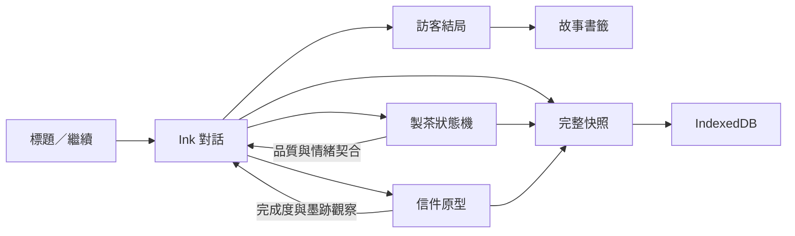

> 茶席增量更新：已完成八種茶、直接拖曳器具、傾斜注水與倒茶、補回茶葉、沙漏暫停及重泡。現行規則見 [可拖曳茶席](HANDS_ON_TEA.md)。

> 2026-09-22 更新：靜蘭完整劇情（三段記憶、四結局與後記）及六段程序式 3D 茶影片已完成。見 [第一章](story/JINGLAN_CHAPTER.md) 與 [茶影片](TEA_FILMS.md)。下文保留初始 Phase 0 計畫作歷史記錄，未完成項目以 README 為準。

# 夜行書店：開發計畫

## 定位與範圍

玩家是暫代店員林澄，透過觀察、泡茶、傾聽與拼信陪伴訪客。數值服務故事，不將人物困境變成需要刷滿的分數。泡錯茶、沒有拼完信都能繼續；替訪客作決定會留下代價。

來源：根目錄三份 v1 規格及 21 張概念圖。原稿保留，不以程式實作反向覆蓋設定。

本次交付為 Phase 0 主架構與第一夜可操作的流程原型，約 5–10 分鐘。不是規格中 35–45 分鐘的完整靜蘭章。原型使用按原稿改編的簡短 Ink 內容，驗證所有核心系統能串接。完整三段記憶、角色立繪拆層、影片與音訊仍需製作。

## 技術與責任

| 層           | 實作與責任                                                                               |
| ------------ | ---------------------------------------------------------------------------------------- |
| 故事         | Ink 唯一擁有信任、理解、介入、茶結果與結局；編譯時拒絕錯誤與不支援標記                   |
| Story Bridge | 一次推進一段文字，解析指令、同步可見 frame，提供可還原快照                               |
| 遊戲狀態     | Pinia 編排 Ink、製茶與拼信；不另行累加敘事數值                                           |
| 小遊戲       | 純函式計分、可序列化 draft、結果回傳指定 Ink knot                                        |
| 存檔         | Dexie v1，3 份輪替自動檔、10 份手動檔、章節完成快照與全域收藏                            |
| UI           | Vue Router 分頁、Vue 元件、CSS tokens、Tailwind 基礎層                                   |
| 演出         | 概念圖 WebP。GSAP/PixiJS/Howler 已列入依賴，待正式影音素材接入時新增 adapter；目前未載入 |
| 離線         | PWA prompt 更新，快取 App Shell 與本原型必要素材                                         |

### 存檔契約

存檔包含格式 version 與 storyVersion，Ink JSON 狀態、當下 frame、製茶和拼信 draft。讀檔只還原，不多執行一次 Continue，避免跳句、重複小遊戲或重複解鎖。以 Zod 驗證外部資料；未知版本明確拒絕而不刪檔。首次 schema 不需虛構舊版 migration，未來每次改版加入明確轉換。

自動存檔序列寫入，避免快速操作的舊快照覆蓋新快照。選項、小遊戲每次操作皆存檔。存檔錯誤會在 UI 顯示，仍允許繼續遊玩。收藏與章節完成快照跟自動存檔在同一 IndexedDB transaction 提交。

## 系統流程

## 開發里程碑

1. **Phase 0，本次**：標題、章節目錄、對話、三種茶、分段製茶、可操作拼信原型、四條靜蘭結局、收藏、設定、存讀檔與自動化驗證。
2. **Phase 1，完整靜蘭章**：擴寫 35–45 分鐘劇情；三段記憶探索；碎片自由拖曳、旋轉、吸附與雙面；六段茶影片、獨立角色立繪、聲音、動畫；真人桌機與手機驗收。
3. **Phase 2，前三章**：柏言的多版本信與若音的雙面譜；第三章員工手冊揭露；章節首進快照和回顧獨立於目前進度。
4. **Phase 3，六位訪客**：葉暖爐火、雨航地圖、海明記憶燈火，共用小遊戲結果契約。
5. **Phase 4，林澄終章**：綜合六章行為判斷四種結局，實作最後訪客席。
6. **Phase 5，發行**：素材授權、內容校閱、效能、輔助科技、跨瀏覽器、部署；雲端存檔另行立案。

## 原稿差異與本次裁決

- 靜蘭茶種以角色章節為準：桂花烏龍、熟普洱、薄荷茶；製茶規格中的洋甘菊保留給柏言。
- `emotional_match` 統一為 `tea_emotional_match`，所有寫入經 bridge。
- 6 段主要動畫、8 個 asset ID 是不同層次，idle/complete/failed 是附加狀態；本次沒有影片素材，使用靜態場景與功能性製茶控制。
- 原圖中的 UI、店主形象只作視覺參考，不把提前露面的店主寫入序章。使用明確命名 manifest 管理採用的圖片。
- 第一夜拼信先採「選碎片 → 選空格」的鍵盤／觸控共用操作，可換片、查看墨跡與保留空白。自由拖曳並未在此原型完成。
- 其他章節顯示未開放，不能透過路由假裝進入未製作內容。

## 驗收

- Ink 全部編譯、tag 允許清單、四種結局可達。
- 茶分數落在 0–100，錯茶仍能抵達結局；墨跡觀察影響最佳理解分支。
- 任一對話與小遊戲階段重整，還原同一文字、選項與操作資料。
- 手動存讀檔、輪替自動檔、收藏不因新遊戲消失。
- 桌機與手機 viewport 完整操作；文字放大、減少動態與鍵盤可用。
- 正式建置與離線重新載入。
