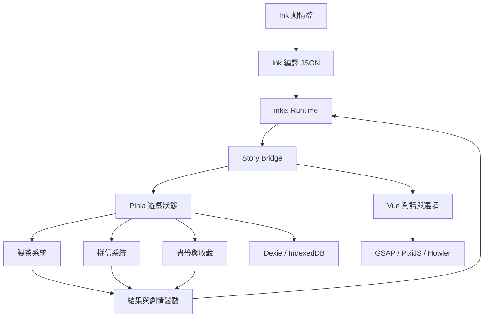

# 《夜行書店》遊戲技術架構規格 v1.0

## 1. 技術決策摘要

《夜行書店》第一版採用 Web 技術開發，不使用 Godot 作為主要引擎。

核心技術組合：

> **Vue 3 + TypeScript + Vite + Ink/inkjs + Pinia + GSAP + PixiJS + Howler.js + Dexie/IndexedDB**

部署目標：

> **Vercel 或 Cloudflare Pages，並以 PWA 形式支援桌機與手機瀏覽器。**

此選擇適合遊戲目前的主要內容：大量文字分支、訪客對話、泡茶與拼信小遊戲、故事書籤、存檔及 Web 分享。若未來加入自由行走、大量場景碰撞或原生平台版本，再評估 Godot 4 + GDScript。

---

## 2. 遊戲技術需求

### 核心玩法

**每晚開店 → 遇見訪客 → 傾聽與選擇 → 解鎖故事書籤 → 逐步揭開書店的祕密。**

### 系統需求

- 分支對話、條件選項與多結局。
- 信任值、理解值、介入度及夜色值。
- 製茶互動與短影片動畫。
- 信件碎片拖曳、旋轉與拼合。
- 訪客立繪、表情、場景及記憶演出。
- 故事書籤、茶方、信件及後日談收藏。
- 多存檔、自動存檔及章節回顧。
- 桌機與手機響應式操作。
- PWA 安裝與基礎離線能力。
- 未來可選擇加入帳號與雲端存檔。

---

## 3. 技術選型

| 領域 | 技術 | 用途 |
|---|---|---|
| UI 框架 | Vue 3 Composition API | 對話框、選項、圖鑑、設定及遊戲介面 |
| 程式語言 | TypeScript | 型別安全、資料模型及模組維護 |
| 建置工具 | Vite | 開發伺服器、打包及環境變數 |
| 敘事引擎 | Ink + inkjs | 分支劇情、條件判斷、變數及結局 |
| 全域狀態 | Pinia | 玩家進度、章節、訪客、設定及 UI 狀態 |
| 路由 | Vue Router | 首頁、遊戲、收藏、設定及章節選擇 |
| UI 動畫 | GSAP | 對話轉場、卡片、書頁、鏡頭及時間軸動畫 |
| 2D 特效 | PixiJS | 雨、蒸氣、光點、水波、紙張與記憶粒子 |
| 音訊 | Howler.js | BGM、環境音、音效、淡入淡出及音量分組 |
| 本機資料庫 | Dexie + IndexedDB | 存檔、收藏、設定及劇情快照 |
| 樣式 | Tailwind CSS + CSS Variables | 響應式介面、主題與設計 Token |
| PWA | vite-plugin-pwa | 安裝、快取、離線啟動及版本更新提示 |
| 單元測試 | Vitest | 劇情橋接、計分、存檔與狀態邏輯 |
| 元件測試 | Vue Test Utils | 對話選擇、設定與互動元件 |
| E2E | Playwright | 主要章節流程、存檔讀檔與手機操作 |
| 格式與品質 | ESLint + Prettier | 程式碼規範及自動格式化 |
| 部署 | Vercel／Cloudflare Pages | 靜態 Web 遊戲發布與 CDN |

---

## 4. 為什麼第一版不使用 Godot

### Web 技術較符合目前需求

- 對話、選項、書籤與信件介面本質上是 UI 密集型內容。
- Vue 更容易處理響應式排版、繁體中文、鍵盤操作與手機觸控。
- Ink 可直接輸出 JSON，透過 inkjs 在瀏覽器執行。
- 拼信可使用 DOM 拖曳或 Canvas，泡茶可結合影片及 PixiJS。
- 可直接部署到既有網站及 Game Together 平台。
- 不需要載入完整遊戲引擎的 WebAssembly Runtime。

### Godot 適用的未來情境

符合下列三項以上時，再評估移植或重製：

- 書店內可以控制角色自由行走。
- 場景含大量碰撞、物理、導航或骨架動畫。
- 要發布 Steam、Windows、macOS 或原生手機 App。
- 需要遊戲手把、全螢幕及原生平台整合。
- 小遊戲數量與複雜度已超出一般 Web UI。

若選擇 Godot Web，建議使用 **Godot 4 + GDScript**。Godot 4 的 C# 專案目前不適合以 Web 匯出為主要目標。

---

## 5. 系統架構



### 架構原則

- Ink 負責「故事內容與條件」。
- Vue 負責「玩家看見及操作的介面」。
- Pinia 負責「遊戲進行中的狀態」。
- Dexie 負責「重新開啟遊戲後仍需存在的資料」。
- PixiJS 只負責需要 Canvas 的特效，不承擔整個 UI。
- 小遊戲透過標準事件與 Ink 交換結果，避免互相直接依賴。

---

## 6. 專案資料夾結構

```text
midnight-bookshop/
├─ public/
│  ├─ audio/
│  │  ├─ bgm/
│  │  ├─ ambience/
│  │  └─ sfx/
│  ├─ video/
│  │  └─ tea/
│  ├─ images/
│  │  ├─ backgrounds/
│  │  ├─ characters/
│  │  ├─ letters/
│  │  ├─ bookmarks/
│  │  └─ ui/
│  └─ story/
│     └─ compiled/
├─ story/
│  ├─ main.ink
│  ├─ common/
│  │  ├─ variables.ink
│  │  ├─ functions.ink
│  │  └─ bookstore.ink
│  ├─ chapters/
│  │  ├─ ch00_prologue.ink
│  │  ├─ ch01_jinglan.ink
│  │  ├─ ch02_boyan.ink
│  │  ├─ ch03_ruoyin.ink
│  │  ├─ ch04_yenuan.ink
│  │  ├─ ch05_yuhang.ink
│  │  ├─ ch06_haiming.ink
│  │  └─ ch07_linchen.ink
│  └─ endings/
├─ src/
│  ├─ components/
│  │  ├─ dialogue/
│  │  ├─ tea/
│  │  ├─ letter-puzzle/
│  │  ├─ bookmark/
│  │  ├─ character/
│  │  └─ common/
│  ├─ views/
│  │  ├─ TitleView.vue
│  │  ├─ GameView.vue
│  │  ├─ ChapterSelectView.vue
│  │  ├─ CollectionView.vue
│  │  ├─ SaveView.vue
│  │  └─ SettingsView.vue
│  ├─ stores/
│  │  ├─ gameStore.ts
│  │  ├─ storyStore.ts
│  │  ├─ teaStore.ts
│  │  ├─ letterStore.ts
│  │  ├─ collectionStore.ts
│  │  ├─ saveStore.ts
│  │  └─ settingsStore.ts
│  ├─ story/
│  │  ├─ inkRuntime.ts
│  │  ├─ storyBridge.ts
│  │  ├─ commandParser.ts
│  │  └─ tagParser.ts
│  ├─ canvas/
│  │  ├─ pixiApp.ts
│  │  ├─ rainEffect.ts
│  │  ├─ steamEffect.ts
│  │  └─ memoryEffect.ts
│  ├─ audio/
│  │  ├─ audioManager.ts
│  │  └─ audioManifest.ts
│  ├─ db/
│  │  ├─ database.ts
│  │  ├─ saveRepository.ts
│  │  └─ migrations.ts
│  ├─ data/
│  │  ├─ teas.ts
│  │  ├─ visitors.ts
│  │  ├─ bookmarks.ts
│  │  └─ chapters.ts
│  ├─ types/
│  ├─ composables/
│  ├─ router/
│  ├─ styles/
│  └─ utils/
├─ scripts/
│  ├─ compile-ink.mjs
│  ├─ validate-story.mjs
│  └─ optimize-assets.mjs
├─ tests/
│  ├─ unit/
│  ├─ component/
│  └─ e2e/
├─ vite.config.ts
├─ tsconfig.json
└─ package.json
```

---

## 7. Ink 敘事架構

### Ink 負責的內容

- 角色台詞與旁白。
- 玩家選項。
- 條件分支與章節跳轉。
- 信任值、理解值與介入度的故事判斷。
- 訪客結局與主角結局。
- 小遊戲開始與完成的命令。
- BGM、背景、人物表情等演出標記。

### Vue 負責的內容

- 對話文字顯示與逐字效果。
- 選項按鈕與鍵盤操作。
- 角色立繪、背景和轉場。
- 製茶、拼信與收藏介面。
- 存檔、讀檔、設定及 PWA。

### Ink 標記範例

```ink
# bg:bookstore_rain
# bgm:midnight_rain
# character:jinglan:sad

靜蘭把藍色信封放在桌上，指尖仍壓著收件人的名字。

* [替她泡一杯桂花烏龍]
    ~ selected_tea = "osmanthus_oolong"
    # minigame:tea:jinglan
    -> wait_for_tea_result

* [先問信封的來歷]
    ~ understanding += 1
    -> ask_letter
```

命令格式統一由 `commandParser.ts` 驗證，避免無效的訪客 ID 或小遊戲名稱進入執行階段。

### 小遊戲回傳

```ts
story.variablesState['tea_quality'] = result.qualityScore
story.variablesState['tea_emotional_match'] = result.emotionalMatch
story.ChoosePathString('tea_result')
```

---

## 8. 遊戲狀態設計

```ts
export interface GameState {
  currentNight: number
  currentChapterId: string
  currentSceneId: string
  currentVisitorId: string | null
  trust: Record<string, number>
  understanding: Record<string, number>
  intervention: Record<string, number>
  nightValue: number
  unlockedBookmarks: string[]
  unlockedTeaRecipes: string[]
  discoveredClues: string[]
  completedEndings: string[]
}
```

### 狀態所有權

| 狀態 | 所有者 |
|---|---|
| 故事文字、選項、條件 | Ink |
| 當前場景與 UI 顯示 | Pinia |
| 製茶進度 | Tea Store |
| 拼信位置及旋轉角度 | Letter Store |
| 收藏解鎖 | Collection Store + IndexedDB |
| 音量、文字速度、動態效果 | Settings Store + IndexedDB |
| Ink 完整快照 | Save Store + IndexedDB |

避免同一個核心數值同時由 Ink 與 Pinia各自修改。需要顯示 Ink 變數時，由 Story Bridge 同步唯讀副本。

---

## 9. 製茶系統

製茶系統採用獨立規格文件定義，技術重點如下：

- 六段短影片控制主要動作。
- Vue 控制選茶、份量、水量及浸泡時間。
- PixiJS 疊加蒸氣、花瓣及記憶圖案。
- Howler.js 同步水聲、瓷器、火爐及環境聲。
- 結果回傳 Ink，改變訪客對話與信任值。

MVP 使用「點擊取茶＋按住注水＋選擇浸泡時間」。自由拖曳茶壺列入後續版本。

---

## 10. 拼信系統

### 技術方案

第一版使用 Vue DOM 元件＋Pointer Events：

- 每片信紙為獨立 `<button>` 或可聚焦元素。
- 支援滑鼠及觸控拖曳。
- 支援點擊旋轉、鍵盤移動及自動吸附。
- 使用 CSS `transform` 控制位置與角度。
- 使用 SVG 或 Path 資料定義拼合邊緣。
- 接近正確位置時顯示墨光，吸附後播放紙張聲。

若未來需要大量不規則碎片、遮罩和物理效果，再改用 PixiJS 實作拼圖區域。

### 拼圖資料模型

```ts
export interface LetterPiece {
  id: string
  image: string
  correctX: number
  correctY: number
  correctRotation: number
  currentX: number
  currentY: number
  currentRotation: number
  side: 'front' | 'back'
  locked: boolean
  clueId?: string
}
```

### 故事判定

- 完成度不一定等於理解度。
- 玩家是否翻面、查看墨水差異及保留矛盾句子，會影響理解值。
- 允許完成錯誤版本並繼續故事，以產生不同結局。

---

## 11. 書籤收藏系統

每位訪客至少對應：

- 1 張基礎書籤。
- 1 張最佳理解書籤。
- 1 張裂痕或未完成版本。
- 1 份專屬茶方。
- 1 句故事句。
- 1 個主線線索。
- 1 段可解鎖後日談。

```ts
export interface Bookmark {
  id: string
  visitorId: string
  title: string
  image: string
  rarity: 'story' | 'memory' | 'truth'
  condition: string
  quote: string
  unlockedAt?: string
  hasCrack?: boolean
}
```

收藏頁不應直接顯示未取得條件，以剪影、缺頁及模糊文字保留探索感。

---

## 12. 存檔系統

### 存檔類型

| 類型 | 數量 | 觸發時機 |
|---|---:|---|
| 自動存檔 | 3 個輪替 | 每個重要選擇、小遊戲完成、場景切換 |
| 手動存檔 | 10 個 | 玩家從選單建立 |
| 章節快照 | 每章 1 個 | 章節首次完成時 |
| 全域進度 | 1 份 | 書籤、茶方、結局及設定更新時 |

### 存檔內容

```ts
export interface SaveGame {
  id: string
  version: number
  createdAt: string
  updatedAt: string
  chapterId: string
  sceneId: string
  playTimeSeconds: number
  screenshot?: string
  inkStateJson: string
  gameState: GameState
  minigameState?: unknown
}
```

### 版本遷移

- 每份存檔都包含 `version`。
- 更新資料結構時新增 migration，不直接破壞舊存檔。
- 無法遷移時仍保留章節完成度、收藏與結局。
- 遊戲更新前建立最後一份相容性快照。

---

## 13. 音訊系統

### 音訊分組

- `bgm`：背景音樂。
- `ambience`：雨聲、書店、火爐、海浪及城市夜景。
- `sfx`：茶具、紙張、門鈴、腳步及 UI。
- `voice`：未來可加入語音或短語氣聲。

### 必要功能

- 各分組獨立音量。
- 場景切換時交叉淡化。
- 瀏覽器切到背景時降低或暫停音量。
- 第一次點擊後才啟用音訊。
- 音訊載入失敗不應阻止故事進行。
- 設定頁提供全部靜音。

---

## 14. 美術與資產規格

| 資產 | 建議格式 | 備註 |
|---|---|---|
| 場景背景 | AVIF + WebP fallback | 桌機 1920×1080，另備手機裁切版本 |
| 角色立繪 | WebP／PNG | 透明背景、統一錨點及尺寸 |
| 書籤 | WebP | 建議 3:8 或 1:3 長比例 |
| UI 圖示 | SVG | 可由 CSS 控色 |
| 短動畫 | WebM + MP4 | 分段預載，不內嵌聲音 |
| 粒子 | WebP／PNG／程式生成 | 小尺寸並建立 Texture Atlas |
| BGM | OGG + MP3 fallback | 需支援循環點 |
| 音效 | OGG／MP3 | 短音效可建立 Sprite 或 Manifest |

資產使用 manifest 管理，不在元件內散落硬編碼路徑。

---

## 15. 響應式與操作設計

### 桌機

- 主要遊戲比例 16:9。
- 對話框位於畫面下方。
- 拼信使用中央大工作區。
- 製茶操作支援滑鼠拖曳及鍵盤。

### 手機

- 場景採中央裁切或角色安全區裁切。
- 對話框高度可捲動，但選項保持可見。
- 拼信可雙指縮放工作區，不依賴精細拖曳。
- 互動目標至少 44×44 CSS px。
- 提供直向模式；關鍵小遊戲可提示旋轉橫向，但不能強制。

### 鍵盤與無障礙

- 數字鍵選擇對話選項。
- Space／Enter 繼續文字。
- Escape 開啟選單。
- 拼圖碎片可 Tab 聚焦並使用方向鍵移動。
- 支援字幕、文字大小、色彩對比與減少動態效果。

---

## 16. PWA 與離線策略

### 預先快取

- App Shell。
- 字體與基礎 UI。
- 第一章必要背景、立繪、Ink JSON 及音效。

### 動態快取

- 玩家開始某章時下載該章素材包。
- 完成章節後保留最近使用的素材。
- 新版本發布時提示玩家更新，不在遊玩中強制重載。

### 離線限制

- 已下載的章節可離線遊玩。
- 雲端存檔、活動及更新檢查需要網路。
- IndexedDB 仍是離線狀態的主要存檔來源。

---

## 17. 後端與雲端存檔

MVP 不需要後端，優先完成單機 Web 版本。

正式版若需要跨裝置存檔，可加入：

```text
Supabase Auth
PostgreSQL
Row Level Security
Object Storage（存檔截圖可選）
```

### 建議資料表

- `profiles`
- `cloud_saves`
- `global_progress`
- `unlocked_bookmarks`
- `completed_endings`
- `devices`

雲端同步採「本機優先＋時間戳衝突提示」，不能在背景直接覆蓋較新的本機存檔。

---

## 18. 測試策略

### 必要單元測試

- 製茶計分。
- 拼信吸附與理解值。
- Ink 標記解析。
- Story Bridge 變數同步。
- 存檔序列化、還原與 migration。
- 書籤與結局解鎖條件。

### 必要 E2E 流程

1. 從標題畫面開始新遊戲。
2. 完成第一位訪客的基本流程。
3. 製茶結果正確改變對話。
4. 拼信完成後正確進入結局。
5. 自動存檔後重新整理頁面並恢復。
6. 手機尺寸完成選項、製茶與拼信。
7. 關閉音效、放大文字及減少動態設定生效。

不需要對純視覺動畫建立大量脆弱測試；優先驗證影響故事和存檔的邏輯。

---

## 19. 效能預算

| 項目 | 目標 |
|---|---:|
| 初次載入 JS（gzip） | 300 KB 以內，PixiJS 可延遲載入 |
| 首頁必要圖片 | 1.5 MB 以內 |
| 單章首批資源 | 8 MB 以內 |
| 單段動畫 | 1～4 MB |
| 同時播放粒子 | 桌機 200、手機 80 以內 |
| 目標 FPS | 桌機 60、手機至少 30 |

### 優化方式

- 路由與章節模組動態載入。
- 圖片使用 AVIF／WebP 與多尺寸來源。
- 影片進入使用前再預載。
- PixiJS 只在需要特效的場景初始化。
- 離開場景後釋放 Texture、影片和音訊資源。
- 手機版降低粒子、模糊與高解析影片。

---

## 20. CI/CD

### Pull Request

```text
pnpm lint
pnpm typecheck
pnpm test
pnpm build
pnpm validate:ink
```

### Main Branch

- 執行完整測試與正式建置。
- 部署 Production。
- 建立版本資訊及素材 manifest。
- 保留前一版可快速回退。

### Ink 驗證

- 所有 Ink 檔案必須成功編譯。
- 驗證重複 Knot、找不到的跳轉及未宣告變數。
- 驗證每章至少有一條可到達結局的路徑。
- 驗證演出 Tag 使用允許清單。

---

## 21. 開發階段

### Phase 0：技術原型

- Vue 對話框。
- inkjs 讀取一段測試故事。
- Pinia 基礎狀態。
- IndexedDB 自動存檔。
- 一段場景轉場與雨聲。

### Phase 1：老奶奶 MVP

- 完整第一章 Ink 劇情。
- 三種茶與製茶動畫。
- 基本拼信。
- 一般、最佳及未完成結局。
- 書籤收藏。
- 手機操作與 PWA。

### Phase 2：前三章

- 上班族多版本信件。
- 小提琴家雙面拼信與旋律互動。
- 第一階段主線線索。
- 章節選擇與回顧。

### Phase 3：六位訪客

- 烘焙師爐火節奏。
- 送信人地圖投遞。
- 燈塔守望者記憶燈火。
- 書店隱藏空間與完整第一幕。

### Phase 4：主角最終章

- 林澄成為最後一位訪客。
- 主角信件拼圖。
- 真正店主登場。
- 四種最終結局。

### Phase 5：正式版

- 完整效能與無障礙調整。
- 雲端存檔可選。
- 成就、後日談及完整收藏。
- 多語系架構。

---

## 22. MVP 完成定義

第一章達成以下條件才算完成：

- 玩家可從標題畫面完成老奶奶章節。
- Ink 分支、變數與三種主要結局能正確執行。
- 製茶動畫在桌機與手機可完成。
- 拼信支援滑鼠、觸控與基本鍵盤操作。
- 製茶和拼信結果會影響對話及書籤。
- 自動存檔可以在重新整理後恢復。
- 收藏頁顯示書籤、茶方與故事句。
- 音量、文字速度、文字大小與減少動態效果可設定。
- PWA 可安裝，已快取的第一章可離線啟動。
- 正式建置沒有 TypeScript、Ink 編譯或關鍵流程錯誤。

---

## 23. 最終決策

《夜行書店》第一版技術定案：

```text
Vue 3
TypeScript
Vite
Ink + inkjs
Pinia
Vue Router
Tailwind CSS
GSAP
PixiJS
Howler.js
Dexie / IndexedDB
vite-plugin-pwa
Vitest
Playwright
Vercel 或 Cloudflare Pages
```

這套架構能延續既有的 Vue、Ink、Pinia 與 PixiJS 經驗，也能把製茶影片、拼信互動、故事書籤及多結局整合在同一個 Web 專案中。MVP 不加入後端，先完成可離線遊玩的單機版本；跨裝置雲端存檔留到正式版評估。

## 24. 參考文件

- [Ink 官方介紹](https://www.inklestudios.com/ink/)
- [Godot Web 匯出文件](https://docs.godotengine.org/en/stable/tutorials/export/exporting_for_web.html)
- [Godot C# 平台支援](https://docs.godotengine.org/en/stable/tutorials/scripting/c_sharp/index.html)
- [PixiJS 官方網站](https://pixijs.com/)
- [GSAP 官方文件](https://gsap.com/docs/v3/)
- [Howler.js](https://howlerjs.com/)
- [Dexie.js](https://dexie.org/)
